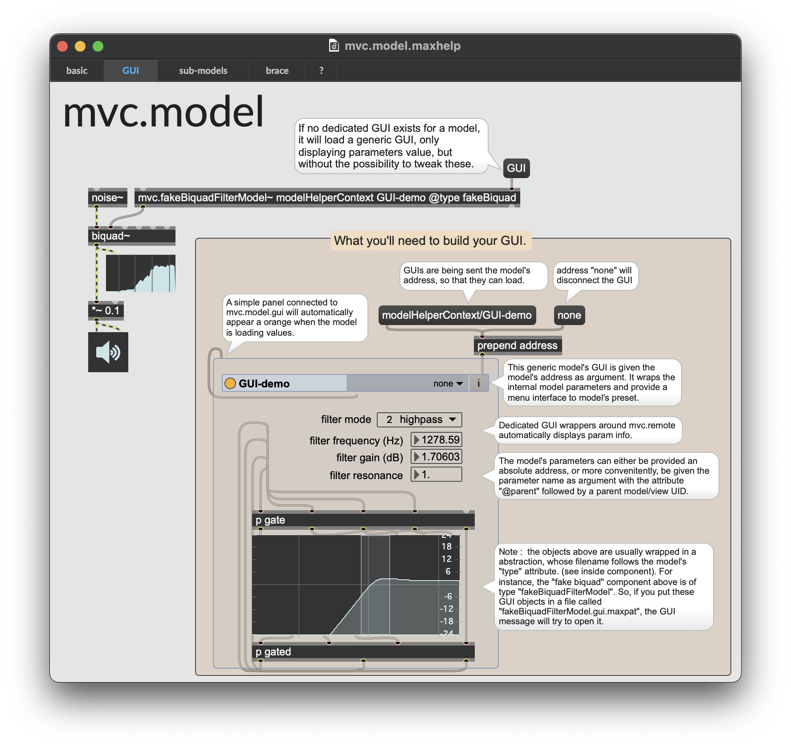

# MVC
<!--  -->

A [Max](https://cycling74.com) package providing a modular standard for structuring patches, following the Model-View-Controller design pattern (aka MVC). It is very similar to (and inspired by) [libossia](https://ossia.io/site-libossia/about.html) and [Jamoma](http://jamoma.org/), but based on vanilla-Max objects.

## How to install

- get and install the latest release from Max at [https://cycling74.com](https://cycling74.com) ;
- get the latest release from AIM package at the [release page](https://github.com/AIM-Framework/AIM-CorePackage/releases) 
  - (or if you are more confident : clone it or fork it from [this page](https://github.com/AIM-Framework/AIM-CorePackage));
- put it in your Max document folder (`home/Documents/Max 8/Packages`);
- that's it.

- Now start Max;
- Select file > Show package manager and check if the MVC package is there (in the installed packages);
- click it and click the "Launch" button to open the `mvc.overview.maxpat` and see the list of available objects.

See also the example folder.

## Dependencies

- No externals are used in this package. It's all Vanilla Max! :)
- Nevertheless, the brace expansion used throughout AIM runs in a [node script](https://docs.cycling74.com/max8/refpages/node.script) that relies on the [braces](https://www.npmjs.com/package/braces) package. This package is automatically fetched and installed on the first use of `mvc.device`.

## What's a Max package anyway ?

- If you really have no idea, watch [this short video](https://www.youtube.com/watch?v=Rh8v1U0dCi4). 
- If you want more details on the guts, check [this document](https://docs.cycling74.com/max8/vignettes/packages).

## Documentation

- See help patchers (and references!), they are your best friends.
- Some video tutorials available on [Youtube](https://www.youtube.com/playlist?list=PLm5d0l7VBINhLS8nBbF4VyB1Eoz_8ecJQ
).
- Some documentation is available in the [documentation folder](./documentation) (but is currently somewhat outdated).

## How the sources are organized on this GitHub repository

This repository adopt follows a hybrid ["GitFlow"](https://www.atlassian.com/en/git/tutorials/comparing-workflows/gitflow-workflow) and [trunk-based](https://www.atlassian.com/continuous-delivery/continuous-integration/trunk-based-development) workflow.

Essentially this means that : 
- unstable development happens in the`develop` branch
- the `develop` branch is merged to the `main` branch once it is stable, like before a release.
- a release branch is made from the `master` branch
- a release is made from a `release/v.x.x.x` branch (with v.x.x.x being the release version number tag), so that any hotfix on this release will be made on that specific branch (and most probably be brought back to the development too, but not to the master).

TLDR;
Better use the `main` branch as much as possible during development.
Use the latest `release` branch if you (temporarily) want a frozen branch.
